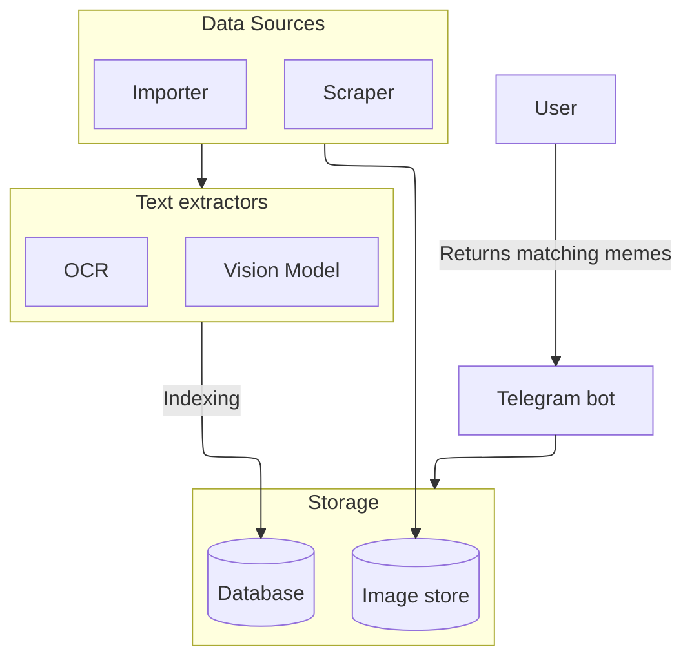

```mermaid

flowchart-elk TD

Importer[Importer]
Scraper[Scraper]
OCR[OCR]
Vision[Vision Model]
Database[(Database)]
ImageStore[(Image store)]
TelegramBot[Telegram bot]

User -->|Returns matching memes| TelegramBot
TelegramBot --> Storage

subgraph DataSources [Data Sources]
    Importer
    Scraper
end

DataSources --> TextExtraction
DataSources --> ImageStore

subgraph TextExtraction [Text extractors]
    OCR
    Vision
end
TextExtraction -->|Indexing| Database
subgraph Storage
    ImageStore
    Database
end
```
