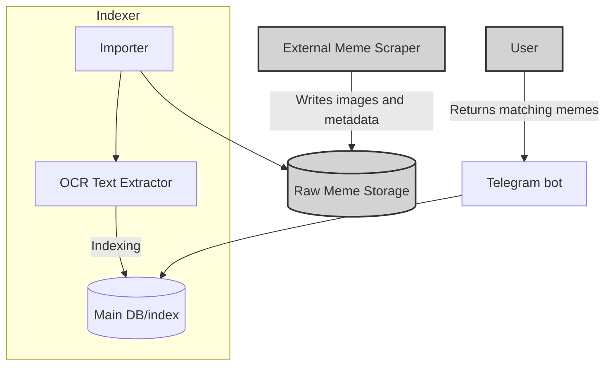

```mermaid

flowchart TD
%% Out-of-Scope Elements (styled in grey)
    Scraper[External Meme Scraper]
    RawDataStorage[(Raw Meme Storage)]
    User[User]

%% In-Scope Processing Pipeline
    Importer[Importer]
    TextExtractor[OCR Text Extractor]
    Database[(Main DB/index)]
    TelegramBot[Telegram bot]

%% Data Flow
    Scraper -->|Writes images and metadata| RawDataStorage

    Importer --> RawDataStorage
    subgraph Pipeline [Indexer]
        Importer --> TextExtractor
        TextExtractor  -->|Indexing| Database
    end
    TelegramBot --> Database


%% Query Pipeline
    User -->|Returns matching memes| TelegramBot

%% Style out-of-scope elements
    style Scraper fill:#d3d3d3,stroke:#333,stroke-width:2px
    style RawDataStorage fill:#d3d3d3,stroke:#333,stroke-width:2px
    style User fill:#d3d3d3,stroke:#333,stroke-width:2px

```
